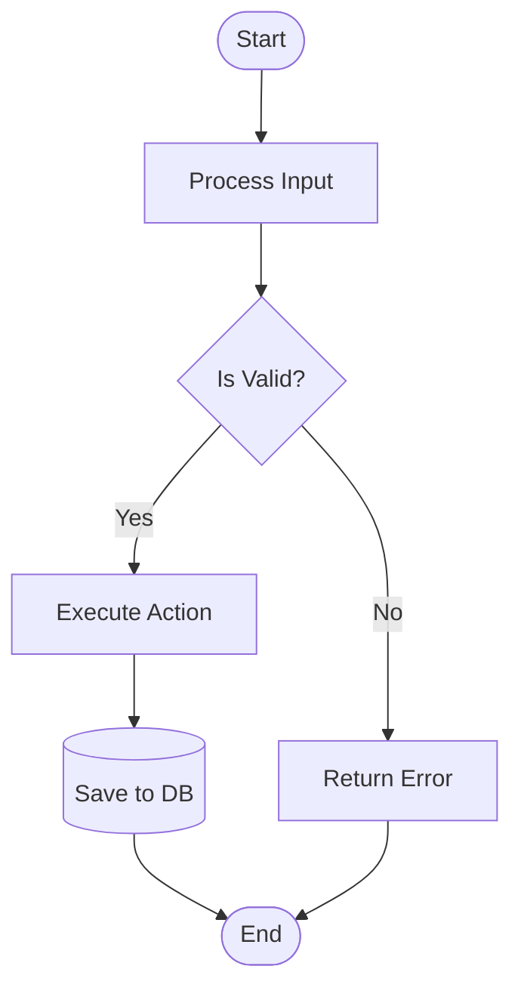
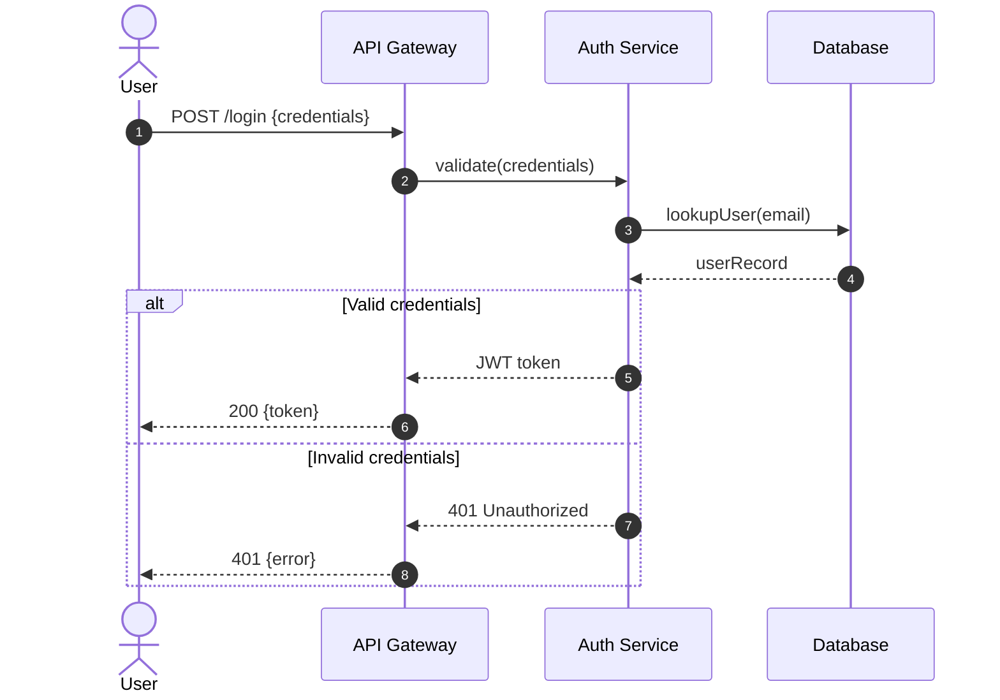
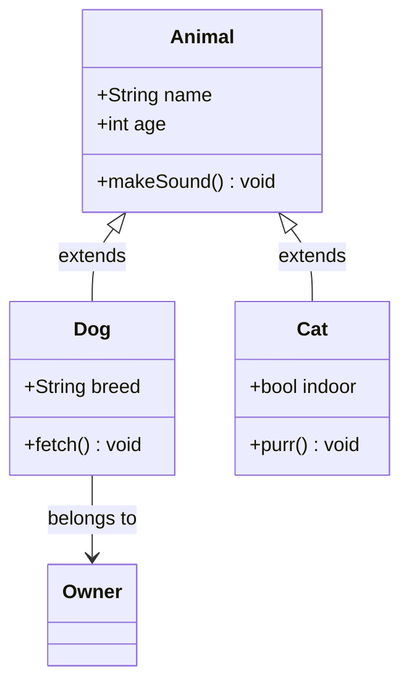
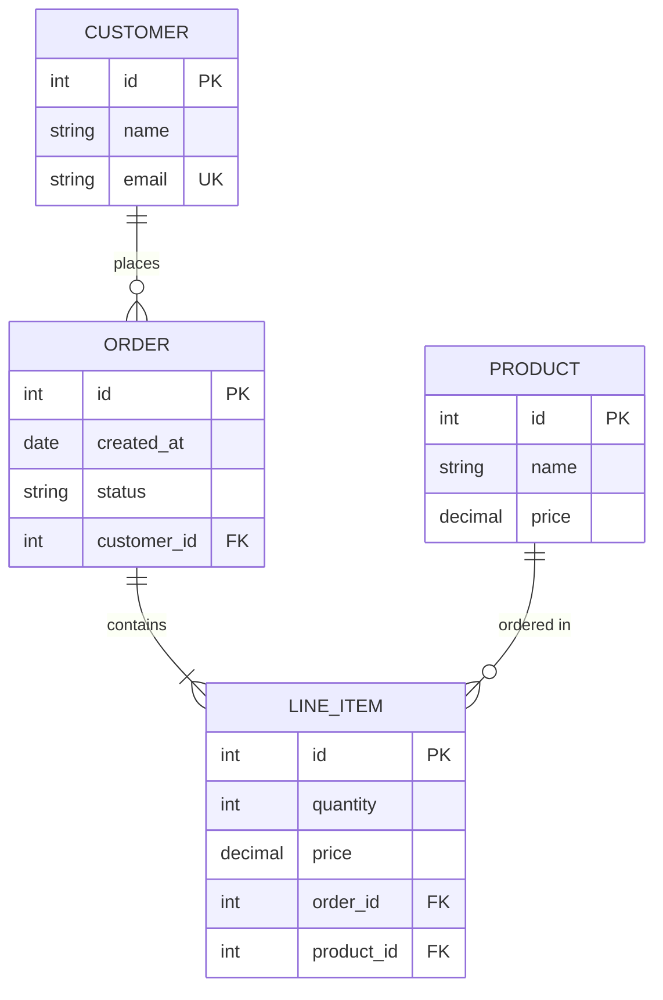
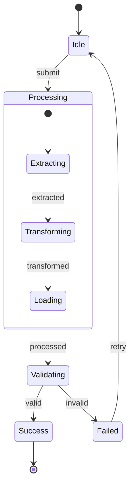
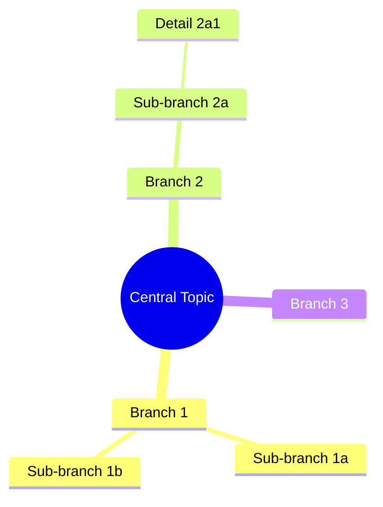

# Mermaid Diagram Builder

A skill for producing **rigorous, precise, and visually clear** diagrams from any textual input. Every diagram must be structurally correct, semantically accurate, and rendered flawlessly.

## Core Philosophy

Diagrams are not decoration — they are **rigorous specifications**. A good diagram eliminates ambiguity, reveals hidden structure, and communicates exactly what text alone cannot. Every node, every edge, every label must be intentional and accurate.

When building a diagram, you are translating human intent into a visual specification. This means:
- **Fidelity**: The diagram must faithfully represent the source material — no invented relationships, no omitted connections, no mislabeled elements.
- **Clarity**: The reader should understand the diagram on first reading, without needing to re-read text for context.
- **Completeness**: If the source describes 7 entities and 5 relationships, the diagram must show all 7 entities and all 5 relationships.
- **Precision**: Labels, directions, cardinalities, and states must be exact — not approximate.

## When to Use This Skill

Use this skill when:
- The user provides a text description and wants it visualized
- The user provides code and wants a diagram of its structure (classes, calls, flow)
- The user provides a specification and wants a sequence diagram, flowchart, or ER diagram
- The user asks to "draw", "map", "visualize", "chart", "illustrate", or "show" any system, process, or structure
- The user provides a scenario and wants a state diagram or timeline
- The user wants to compare architectures, workflows, or data models
- The user asks for a mindmap of concepts, topics, or hierarchies

## Step 1: Analyze the Input

Before writing any Mermaid code, systematically analyze the input:

### 1.1 Identify the diagram type

Read `references/diagram-types.md` for the full catalog of Mermaid diagram types and when to use each. Use this decision framework:

| User Intent | Best Diagram Type |
|---|---|
| Process, workflow, decision logic | `flowchart` |
| Interactions over time between actors | `sequenceDiagram` |
| Object structure, inheritance, composition | `classDiagram` |
| System states and transitions | `stateDiagram-v2` |
| Database schema, entity relationships | `erDiagram` |
| Timeline, scheduling, phases | `gantt` |
| Part-whole, component hierarchy | `mindmap` |
| Data flow, pipelines | `flowchart LR` (left-to-right) |
| Network topology, deployment | `flowchart` with subgraphs |
| Proportions, distribution | `pie` |
| Requirements traceability | `requirementDiagram` |
| Git branching | `gitGraph` |
| Quadrant analysis | `quadrantChart` |
| Journey, user experience | `journey` |
| C4 architecture | `C4Context` / `C4Container` / `C4Deployment` |

If the input could match multiple types, pick the **primary** one and note the alternatives. You can offer to create additional diagrams for secondary perspectives.

### 1.2 Extract entities, relationships, and properties

From the input text, extract:
- **Entities** (nouns): Every distinct object, actor, system, class, table, state, or concept
- **Relationships** (verbs/descriptors): How entities connect — direction, label, cardinality
- **Properties** (attributes): Fields, parameters, descriptions, data types
- **Flow/Sequence** (order): Steps, dependencies, temporal ordering

Write these down explicitly before coding. This prevents missing elements.

### 1.3 Validate completeness

After extraction, cross-reference against the original input:
- Have all mentioned entities been included?
- Have all described relationships been captured?
- Are labels accurate and using the exact terminology from the input?
- Are cardinalities correct (1:1, 1:N, N:M)?
- Are directions correct (who initiates, who responds)?

## Step 2: Output Format — Dual Output Strategy

Every diagram generation produces **three files**:

| File | Purpose | Notes |
|------|---------|-------|
| `*.mmd` | Mermaid source | Persisted alongside SVG for re-generation |
| `*.svg` | Presentation-ready | Transparent background, for PowerPoint/Google Slides |
| `*.html` | Interactive viewing | Aggregates ALL diagrams from the request |

### SVG Output for Presentations

SVG files are optimized for presentation tools:
- **Transparent background** (`-b transparent`): Blends into any slide theme
- **Default theme** (`-t default`): Maximum compatibility
- **Vector format**: Scales to any size without quality loss

### HTML Output

The HTML file renders all diagrams with:
- Professional styling (classDef colors)
- Zoom, pan, and fullscreen capabilities
- Copy-to-clipboard for Mermaid source
- Dark/light theme toggle

### Multiple Diagrams

When a request produces multiple diagrams:
- Each diagram generates its own `.mmd` and `.svg` pair
- HTML file contains ALL diagrams with tab navigation
- Final output lists all generated files

### Output Structure Example

```
<output-dir>/
├── flowchart_2026-04-12_14-30-45.mmd
├── flowchart_2026-04-12_14-30-45.svg
├── sequence_2026-04-12_14-30-46.mmd
├── sequence_2026-04-12_14-30-46.svg
└── all-diagrams.html
```

## Step 3: Build the Diagram

### 3.1 Mermaid Syntax Rules — Rigor Checklist

Every Mermaid diagram must pass this checklist:

**Structural correctness:**
- [ ] All node IDs are unique and valid (alphanumeric, no spaces in IDs)
- [ ] All referenced node IDs actually exist (no dangling edges)
- [ ] No duplicate edges between the same pair of nodes with the same label
- [ ] Subgraph names are unique and valid
- [ ] Special characters in labels are properly escaped or quoted
- [ ] Strings containing `()`, `{}`, `[]`, `#`, `&`, `<`, `>` are wrapped in quotes
- [ ] Semicolons are used to terminate statements where required
- [ ] Class diagram method syntax uses correct parentheses `+method()` not `+method`

**Semantic accuracy:**
- [ ] Every entity from the source text appears in the diagram
- [ ] Every relationship from the source text is represented
- [ ] Direction arrows point the correct way (who → whom)
- [ ] Cardinalities match the source (1:1, 1:N, N:M)
- [ ] Labels use the exact terminology from the input
- [ ] States and transitions match the described behavior

**Visual clarity:**
- [ ] Direction is appropriate (`TD` for top-down, `LR` for left-to-right)
- [ ] Node shapes convey meaning (rectangles for processes, diamonds for decisions, rounded for start/end)
- [ ] Subgraphs group related elements logically
- [ ] The diagram is not too wide or too deep — consider splitting if >20 nodes
- [ ] Labels are concise but not cryptic

### 3.2 Common Pitfalls to Avoid

| Pitfall | Fix |
|---|---|
| Node ID with spaces | Use `id_with_underscores` or `id-with-hyphens` and set label separately |
| Unquoted labels with special chars | Wrap in quotes: `["Label (detail)"]` |
| Forgetting semicolons in class diagrams | `class MyClass { +field: string +method(): void }` |
| Circular layouts that become unreadable | Use `direction LR` or `direction TB` in subgraphs |
| Too many crossing edges | Reorder nodes, use `linkStyle` to route, or split into multiple diagrams |
| Missing `end` keyword in flowcharts | Every `if` needs an `end` |
| Arrow direction confusion | `A --> B` means "A flows to B", not "B depends on A" |
| Mermaid version incompatibilities | Stick to well-supported features documented in `references/mermaid-syntax.md` |

### 3.3 Naming Conventions

- **Node IDs**: `snake_case` (e.g., `user_service`, `auth_module`, `process_payment`)
- **Subgraph IDs**: `snake_case` with descriptive prefix (e.g., `grp_frontend`, `grp_database_layer`)
- **Labels**: Human-readable, exact terminology from input (e.g., `"User Service"`, `"Process Payment"`)
- **Class/method names**: Use the exact names from source code if analyzing code

### 3.4 Direction and Layout

Choose the flow direction deliberately:

- **`flowchart TD`** (top-down): Hierarchies, org charts, vertical processes, decision trees
- **`flowchart LR`** (left-to-right): Timelines, data pipelines, horizontal flows, reading order
- **`sequenceDiagram`**: Always top-to-bottom (default), use `autonumber` for step numbering
- **`classDiagram`:** Use `direction LR` or `direction TB` for readability
- **`stateDiagram-v2`**: Use `direction LR` for linear state machines, `direction TB` for branching

### 3.5 Style and Theming

For HTML output, apply consistent, professional styling:

```mermaid
%% Styling example for flowcharts
classDef process fill:#4A90D9,stroke:#2C5F8A,color:#fff,stroke-width:2px
classDef decision fill:#F5A623,stroke:#D4881E,color:#fff,stroke-width:2px
classDef data fill:#7ED321,stroke:#5DAA1B,color:#fff,stroke-width:2px
classDef error fill:#D0021B,stroke:#9B0215,color:#fff,stroke-width:2px
classDef startend fill:#9B59B6,stroke:#7D3C98,color:#fff,stroke-width:2px

class user_input process
class validate decision
class db data
```

Apply semantic color coding consistently:
- **Blue (#4A90D9)**: Process steps, actions
- **Orange/Amber (#F5A623)**: Decision points, conditions
- **Green (#7ED321)**: Data stores, success outcomes, external systems
- **Red (#D0021B)**: Error paths, failure outcomes
- **Purple (#9B59B6)**: Start/end nodes, milestones

## Step 4: Generate SVG Output (mermaid-cli)

### 4.1 Check Prerequisites

Before generating SVG, verify mermaid-cli is available:

```bash
MMDC="./node_modules/.bin/mmdc"
if [ ! -f "$MMDC" ]; then
    echo "Installing mermaid-cli..."
    npm install @mermaid-js/mermaid-cli --save-dev
fi
```

If npm install fails, stop and instruct the user to install manually:
```
Please run: npm install @mermaid-js/mermaid-cli --save-dev
Then re-run the diagram generation.
```

### 4.2 Generate .mmd Source File

Create the Mermaid source file with timestamp-based naming:

```bash
TIMESTAMP=$(date +%Y-%m-%d_%H-%M-%S)
DIAGRAM_TYPE=$(echo "$MERMAID_CODE" | head -1 | grep -oE '^[a-zA-Z]+' || echo "diagram")
MMD_FILE="<output-dir>/${DIAGRAM_TYPE}_${TIMESTAMP}.mmd"
echo "$MERMAID_CODE" > "$MMD_FILE"
```

### 4.3 Convert to SVG with mmdc

Execute mermaid-cli to generate SVG:

```bash
SVG_FILE="${MMD_FILE%.mmd}.svg"
./node_modules/.bin/mmdc \
    -i "$MMD_FILE" \
    -o "$SVG_FILE" \
    -b transparent \
    -t default \
    -c config/mermaid-config.json

if [ ! -f "$SVG_FILE" ] || [ ! -s "$SVG_FILE" ]; then
    echo "ERROR: SVG generation failed"
    exit 1
fi
```

Flags used:
- `-b transparent`: Transparent background for slide compatibility
- `-t default`: Default theme for maximum compatibility
- `-c config/mermaid-config.json`: Preserve styling configuration

### 4.4 Verify SVG Output

Check the generated SVG:
- File exists and has size > 0
- Contains valid SVG markup (`<svg` tag)
- No error messages from mmdc

## Step 5: Generate HTML Output

For standalone HTML, always use this template structure. Read `references/html-template.md` for the complete template.

The HTML file must:
1. Include Mermaid.js from CDN (`https://cdn.jsdelivr.net/npm/mermaid@11/dist/mermaid.min.js`)
2. Initialize Mermaid with proper configuration
3. Support zoom, pan, and fullscreen
4. Use a clean, professional layout
5. Include a copy-to-clipboard button for the raw Mermaid code
6. Handle rendering errors gracefully
7. Support both light and dark themes

### Multiple Diagrams

If the input naturally produces multiple perspectives (e.g., a class diagram AND a sequence diagram), generate all of them in a single HTML page with tab navigation or vertical sections. Each diagram should have a clear heading explaining what perspective it represents.

## Step 6: Validate and Iterate

After generating the diagram:

1. **Mental walkthrough**: Trace every path in the diagram. Does it match the source text?
2. **Completeness check**: Count entities and relationships in the source vs. the diagram.
3. **Readability check**: Can someone unfamiliar with the source understand the diagram?
4. **Render test**: If possible, verify the Mermaid syntax is valid by checking for common syntax errors.

5. **SVG verification**: Confirm .svg file exists and has valid content (`<svg` tag, non-zero size)
6. **MMD source check**: Confirm .mmd file persists alongside SVG for future re-generation

If the diagram is complex (>15 nodes), consider:
- Splitting into multiple focused diagrams
- Adding a simplified overview + detailed sub-diagrams
- Using subgraphs to group related elements

## Step 7: Report Generated Files

After successful generation, report to the user:

```
Generated files:
├── <type>_<timestamp>.mmd  (Mermaid source)
├── <type>_<timestamp>.svg  (Presentation-ready)
└── all-diagrams.html       (Interactive viewer)
```

Present the SVG path clearly for direct use in PowerPoint/Google Slides.

## Specific Diagram Type Guidelines

### Flowcharts



Rules:
- Always have a clear start and end node
- Use `{{}}` for decisions (rhombus)
- Use `[]` for processes (rectangle)
- Use `[()]` for databases (cylinder)
- Use `(())` for start/end (stadium shape)
- Label every edge, especially decision branches (Yes/No, True/False)
- Use subgraphs to group related steps
- For complex flows, add a note: `note1:::note` with `classDef note fill:#FFF9C4`

### Sequence Diagrams



Rules:
- Always use `autonumber` for step tracking
- Declare all participants with `participant` (use aliases for long names)
- Use `->>` for synchronous calls, `-->>` for responses
- Use `alt/else/end` for conditional flows
- Use `loop` for iterations
- Use `Note over` for annotations that clarify intent
- Use `rect rgb(...)` to highlight critical sections
- Include error paths (don't only show the happy path)

### Class Diagrams



Rules:
- Use proper UML notation: `+` public, `-` private, `#` protected
- Include types for fields and return types for methods
- Use `<|--` for inheritance, `-->` for association, `--*` for composition, `--o` for aggregation
- Group classes into packages using `namespace`
- For large diagrams, use `direction LR` to prevent excessive width

### ER Diagrams



Rules:
- Always include cardinality markers (`||--o{`, `||--|{`, etc.)
- Use `PK`, `FK`, `UK` annotations on key fields
- Include data types for every field
- Name relationships with descriptive verbs in quotes
- Order fields: PK first, then FK, then regular fields

### State Diagrams



Rules:
- Always include `[*]` for initial and final states
- Label every transition with the triggering event
- Use composite states (nested `state`) for complex state machines
- Include error/recovery transitions
- Use `note left of` / `note right of` for state descriptions

### Mindmaps



Rules:
- Keep labels short (1-3 words)
- Balance branches — avoid one dominant branch
- Use 2-4 levels of depth
- The root should capture the essence of the entire topic

## Handling Complexity

### Splitting Large Diagrams

When a diagram exceeds 20+ nodes or becomes visually dense:

1. **Create an overview diagram** showing only top-level entities and major relationships
2. **Create detail diagrams** for each subgraph or subsystem
3. **Use consistent naming** so the reader can cross-reference between diagrams
4. **Link them in the HTML** with a table of contents or navigation

### Handling Ambiguity in Input

When the input is ambiguous:
- **Prefer the most likely interpretation** and note the assumption in a comment
- **Ask the user** if the ambiguity is critical to correctness
- **Use the most general diagram type** that captures the essence
- **Add Mermaid notes** (`%% comment`) to document assumptions

## Quality Assurance Protocol

Before delivering any diagram, verify:

1. **Syntactic correctness**: The Mermaid code parses without errors
2. **Semantic correctness**: Every element in the source text is represented
3. **Relational correctness**: All relationships/directions/cardinalities match the source
4. **Visual correctness**: The layout is readable, not overly wide or deep
5. **Label correctness**: All labels use exact terminology from the source
6. **Completeness**: No entities or relationships are missing
7. **SVG generation**: mmdc command executed successfully, .svg file exists with valid content
8. **File persistence**: Both .mmd and .svg files exist in output directory

If any check fails, fix before delivering.

## File Organization

When generating a diagram:
1. Analyze the input (entities, relationships, flow)
2. Select the appropriate diagram type(s)
3. Write the Mermaid code
4. Validate against the rigor checklist
5. Check/install mermaid-cli if SVG output requested
6. Generate .mmd source file (timestamp-based naming)
7. Run mmdc to generate .svg file
8. Generate HTML file (aggregates all diagrams)
9. Save to the user's requested location (default: current directory)
10. Report all generated files to user
11. If the user wants to iterate, modify and re-render

## Reference Files

- **`references/diagram-types.md`**: Comprehensive catalog of Mermaid diagram types with syntax reference and when to use each
- **`references/html-template.md`**: Complete HTML template for rendering Mermaid diagrams with professional styling, zoom/pan, dark mode, and clipboard support
- **`references/mermaid-syntax.md`**: Detailed Mermaid syntax reference covering all diagram types, with common patterns and pitfalls
- **`references/mmdc-usage.md`**: Mermaid CLI (mmdc) usage guide for SVG generation, installation, and troubleshooting
- **`config/mermaid-config.json`**: Default configuration for mmdc to preserve styling
- **`scripts/install-mmdc.sh`**: Installation script for mermaid-cli in local node_modules