# Mermaid Diagram Types — Complete Reference

This document catalogs all Mermaid diagram types with syntax, use cases, and examples.

---

## 1. Flowchart (`flowchart`)

**When to use**: Process flows, decision trees, workflows, algorithms, system logic, data pipelines.

**Key advantage**: Most versatile diagram type. Supports subgraphs, styling, and multiple layout directions.

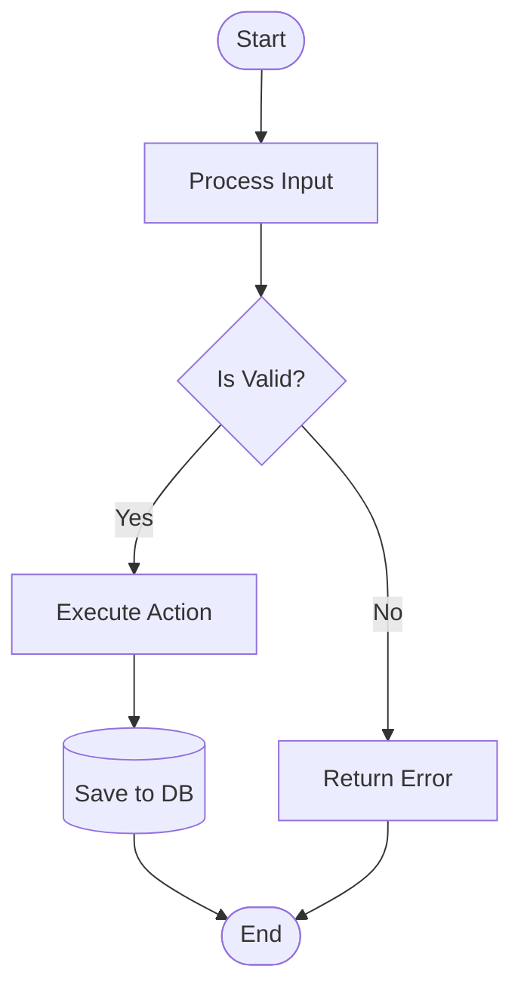

**Node shapes**:
- `[A]` — Rectangle (process)
- `(A)` — Rounded rectangle (start/end)
- `{A}` — Diamond (decision)
- `([A])` — Stadium/pill shape
- `[[A]]` — Subprocess
- `[(A)]` — Cylinder (database)
- `((A))` — Circle
- `{{A}}` — Hexagon
- `>A]` — Asymmetric (flag right)
- `[A/]` — Parallelogram (input/output)

**Edge types**:
- `-->` — Arrow with line
- `---` — Line without arrow
- `-.->` — Dotted arrow
- `==>` — Thick arrow
- `-->|text|` — Arrow with label
- `--text-->` — Arrow with inline label

**Directions**: `TD` (top-down), `TB` (top-bottom = TD), `BT` (bottom-top), `LR` (left-right), `RL` (right-left)

**Subgraphs**: Group related nodes
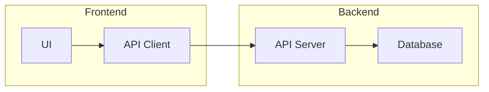

---

## 2. Sequence Diagram (`sequenceDiagram`)

**When to use**: Interactions between actors/systems over time, API call flows, protocol exchanges, user journeys with system touchpoints.

**Key advantage**: Shows temporal ordering and message passing clearly.

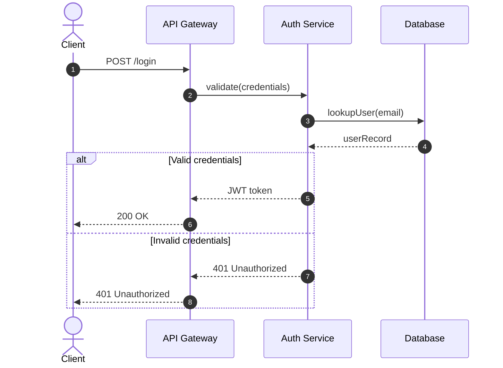

**Key syntax**:
- `actor A` — Stick figure
- `participant A` — Rectangle
- `participant A as "Long Name"` — With alias
- `A->>B` — Solid arrow (request)
- `A-->>B` — Dashed arrow (response)
- `A-)B` — Open arrow (async)
- `alt/else/end` — Conditional
- `opt/end` — Optional
- `loop/end` — Iteration
- `par/and/end` — Parallel
- `critical/option/end` — Critical section
- `Note over A,B: text` — Annotation
- `rect rgb(r,g,b)` — Background highlight
- `activate A` / `deactivate A` — Show lifeline activation

---

## 3. Class Diagram (`classDiagram`)

**When to use**: Object-oriented design, database schema visualization, API models, domain modeling.

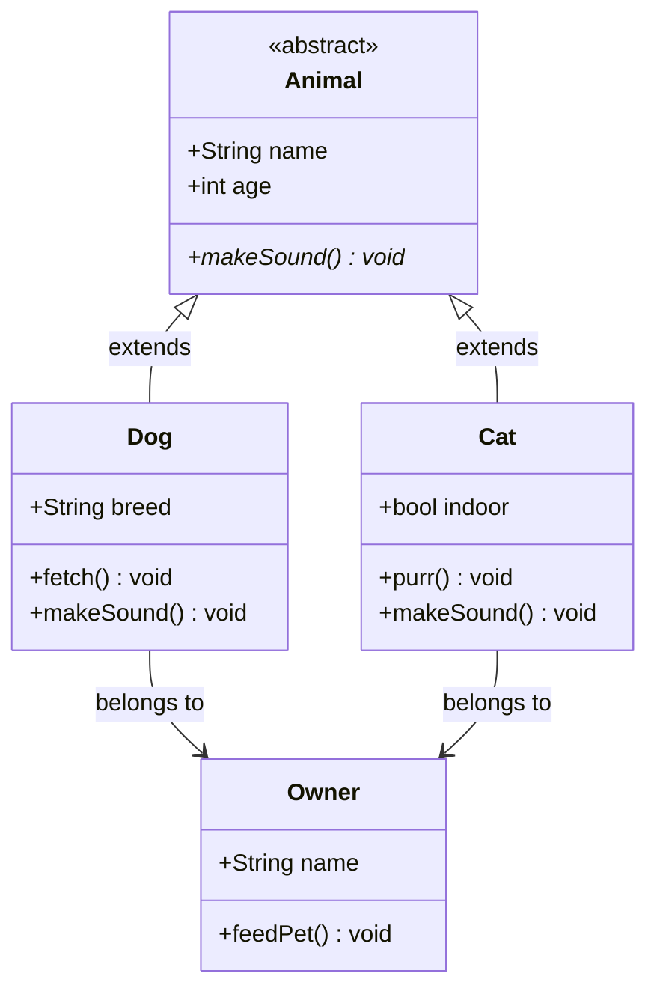

**Key syntax**:
- Visibility: `+` public, `-` private, `#` protected, `~` package/internal
- `<<interface>>` / `<<abstract>>` — Stereotypes
- `<|--` — Inheritance
- `-->` — Association
- `--*` — Composition
- `--o` — Aggregation
- `..>` — Dependency
- `..|>` — Realization (implements)
- `namespace` — Grouping
- `direction LR` or `direction TB` — Layout direction

**Relationship cardinalities**:
- `A "1" --> "1" B` — One to one
- `A "1" --> "*" B` — One to many
- `A "1" --> "0..1" B` — One to zero-or-one
- `A "*" --> "*" B` — Many to many

---

## 4. State Diagram (`stateDiagram-v2`)

**When to use**: State machines, order statuses, workflow states, protocol states, lifecycle modeling.

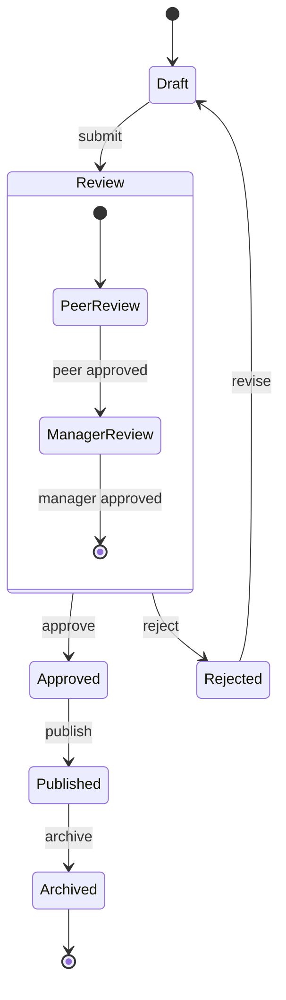

**Key syntax**:
- `[*]` — Initial/final state
- `A --> B : trigger` — Transition with label
- `state A { }` — Composite/nested state
- `note left of A: text` — Annotation
- `direction LR` / `direction TB` — Layout

---

## 5. Entity-Relationship Diagram (`erDiagram`)

**When to use**: Database design, data modeling, schema visualization, system relationships.

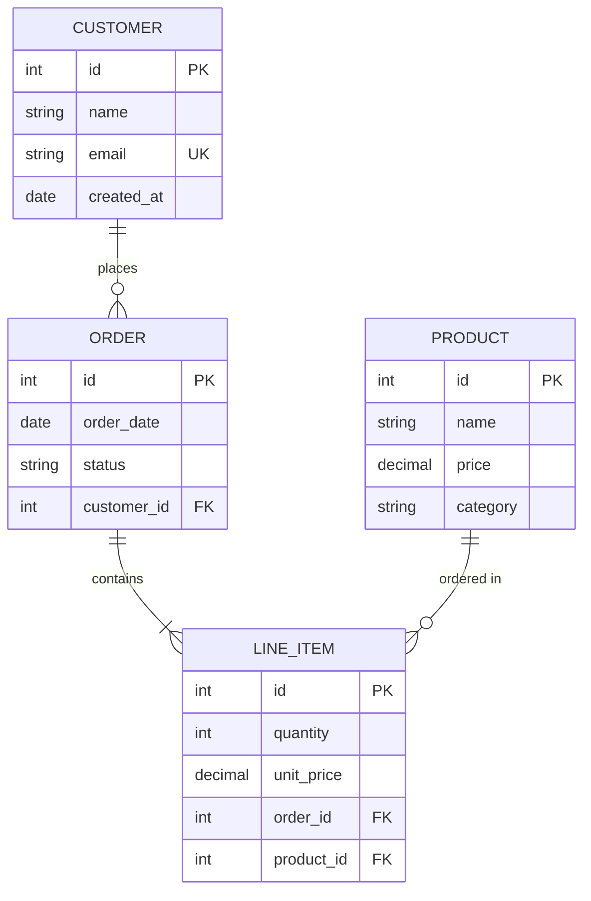

**Cardinality markers**:
- `||` — Exactly one
- `|o` — Zero or one
- `|{` — One or more
- `o{` — Zero or more
- `o|o` — Zero or one (both sides)

**Key annotations**: `PK` (primary key), `FK` (foreign key), `UK` (unique key)

---

## 6. Gantt Chart (`gantt`)

**When to use**: Project timelines, sprint planning, milestone tracking, phased delivery schedules.

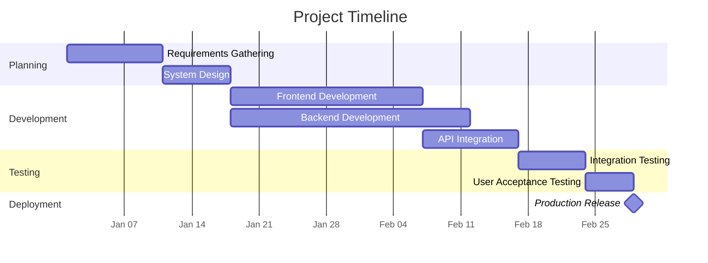

**Key syntax**:
- `dateFormat` — Input date format
- `axisFormat` — Display format for axis
- `section` — Groups tasks
- `:id, start, duration` — Task definition
- `:milestone` — Milestone marker
- `after id` — Dependency
- `crit` — Critical path
- `active` — Active task
- `done` — Completed task

---

## 7. Pie Chart (`pie`)

**When to use**: Proportional data, market share, distribution analysis, budget breakdowns.

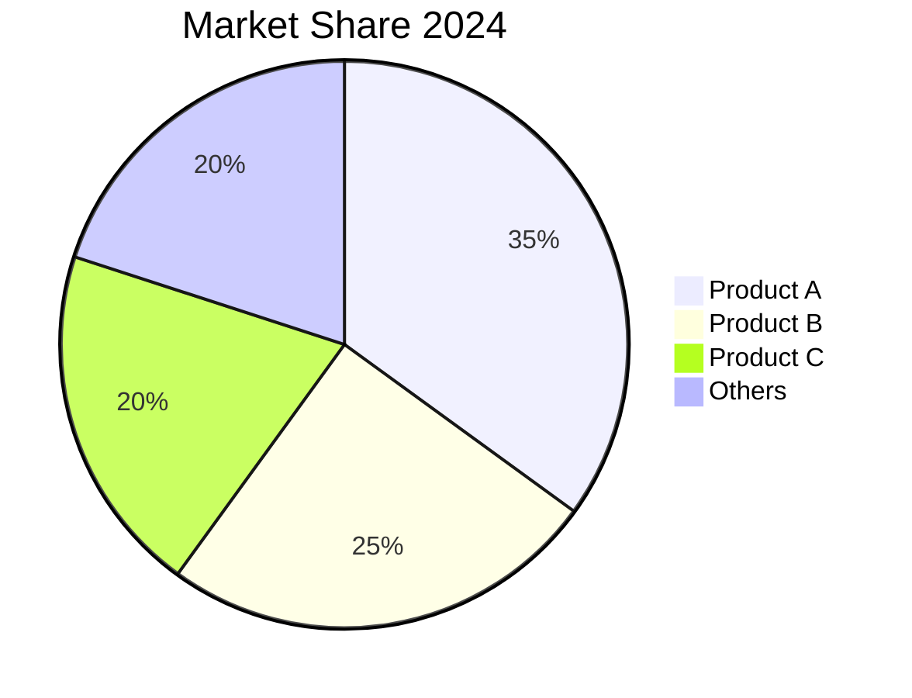

---

## 8. Mindmap (`mindmap`)

**When to use**: Brainstorming, topic hierarchies, concept mapping, organizational structures, knowledge trees.

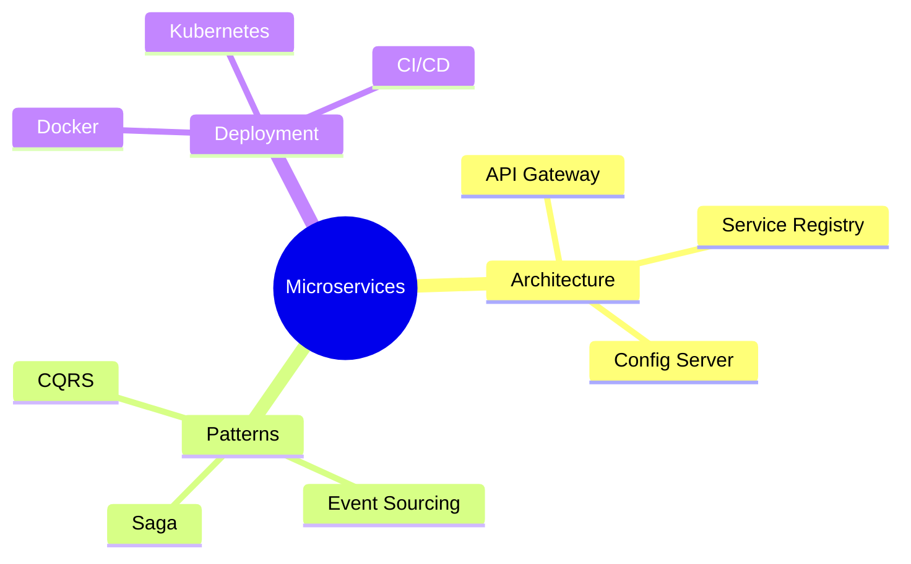

---

## 9. Quadrant Chart (`quadrantChart`)

**When to use**: Priority matrices, risk assessment, impact-effort analysis, strategic positioning.

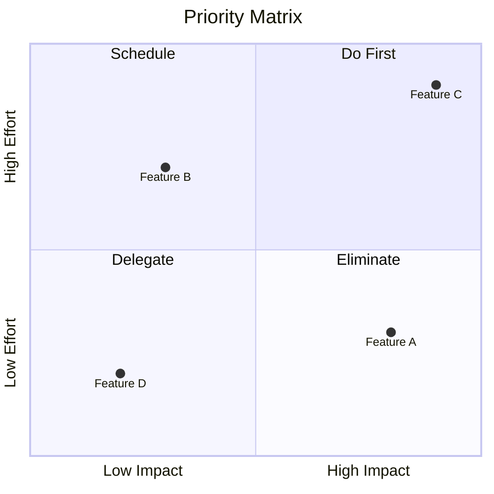

---

## 10. Requirement Diagram (`requirementDiagram`)

**When to use**: Requirements traceability, compliance mapping, specification linking.

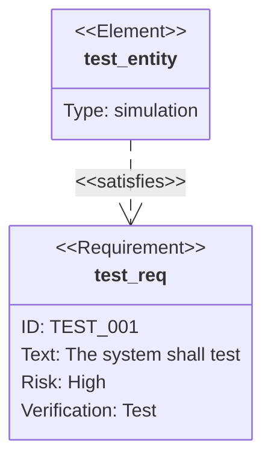

---

## 11. Gitgraph (`gitGraph`)

**When to use**: Git workflow visualization, branching strategy, release process illustration.

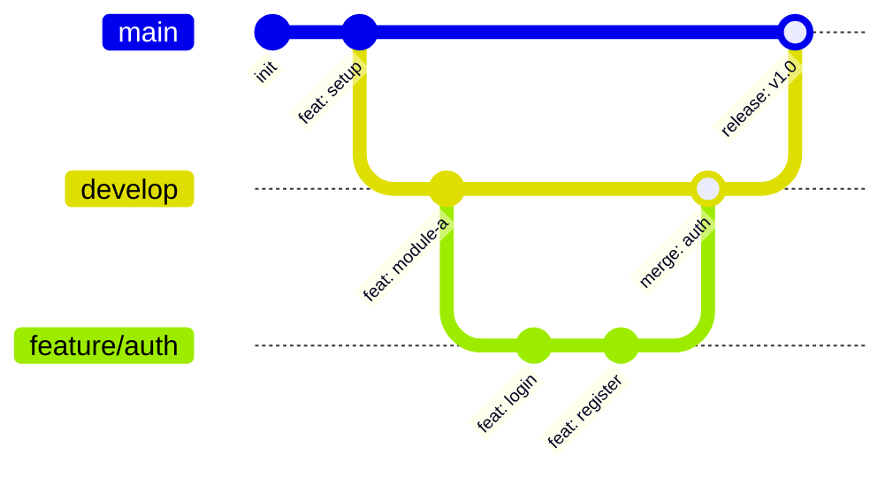

---

## 12. Journey (`journey`)

**When to use**: User experience flows, customer journeys, service blueprints.

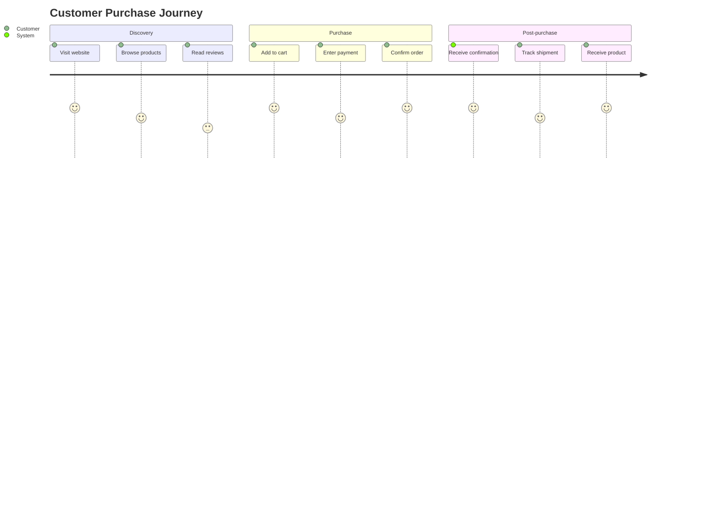

**Score**: 1-5 (1=terrible, 5=excellent experience)

---

## 13. C4 Architecture Diagrams

**When to use**: Software architecture at different zoom levels (context, containers, components, code).

### C4 Context
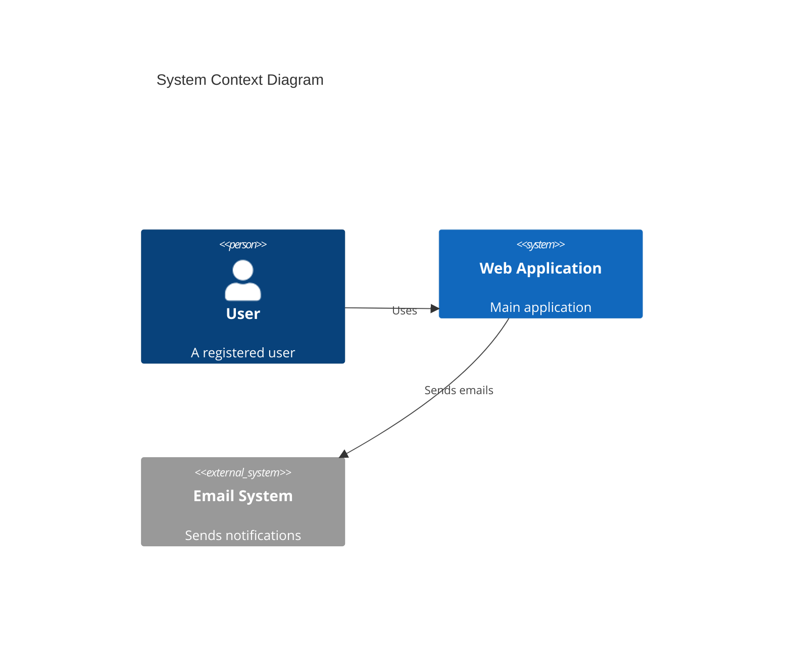

### C4 Container
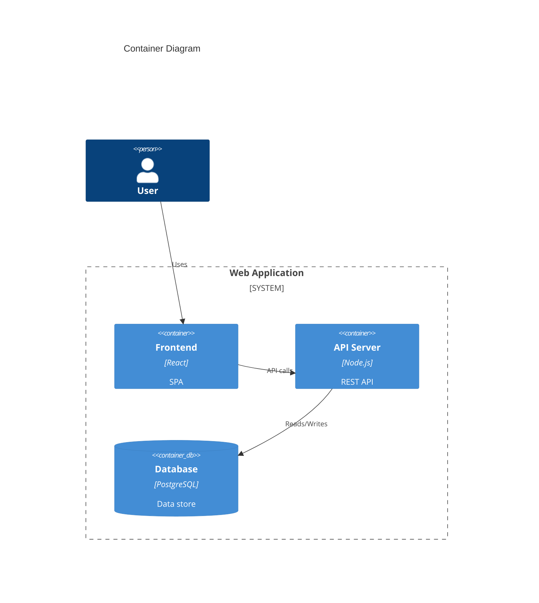

---

## 14. Sankey (`sankey`)

**When to use**: Flow of resources, energy, money, or any quantity between nodes. Shows magnitude of flow.

*(Available in Mermaid 11+)*

---

## 15. Timeline (`timeline`)

**When to use**: Historical events, project milestones, chronological narratives.

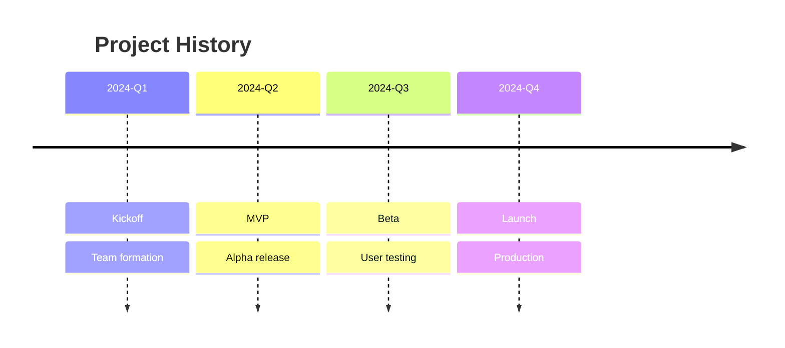

---

## Choosing the Right Diagram Type

When multiple types could work, prefer:
1. **Flowchart** for anything procedural or decision-based (most versatile)
2. **Sequence diagram** when time-ordering and message-passing matters
3. **Class/ER diagram** when structure and relationships matter more than flow
4. **State diagram** when entities have discrete states and transitions
5. **Mindmap** when the structure is hierarchical and there's no "flow"

When in doubt, **offer the user a choice** between 2-3 appropriate types with a brief explanation of what each would highlight.